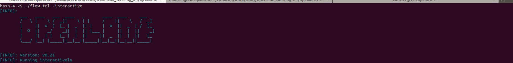
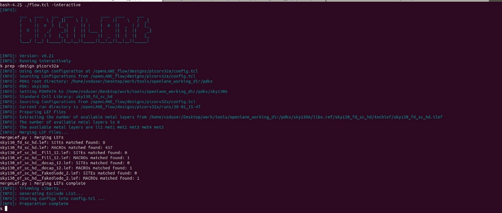
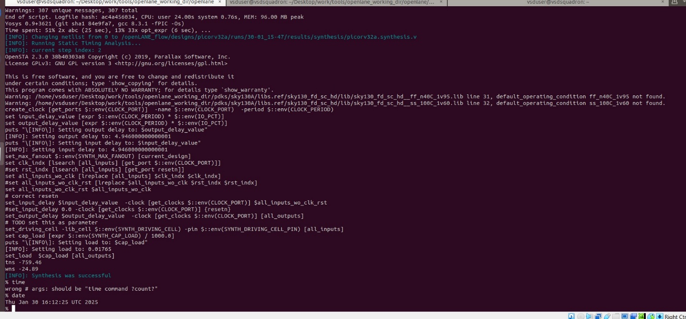
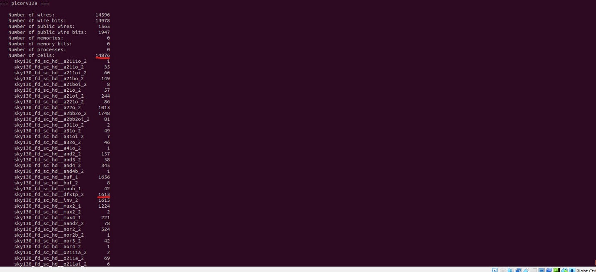
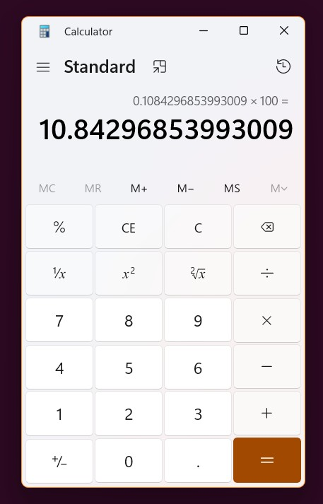
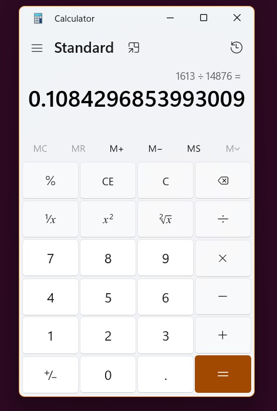

[DAY-1 Inception of open-source EDA, OpenLANE and Sky130
PDK.]{.underline}

*[Workshop 1- Find Floppy disk ratio]{.underline}*

To get the Floppy disk ratio, we first need to run Synthesis.

Step-1: First, we run the command

{width="7.119047462817148in"
height="1.6604166666666667in"}[./flow.tcl -interactive]{.underline} in
the docker.

Step-2: Now, we run the command

{width="5.333333333333333in"
height="2.2680555555555557in"}[prep -design picorv32a]{.underline} after
the first step.

Step-3: The final step is to do the command [run_synthesis]{.underline}.

{width="6.5in" height="3.026388888888889in"}

Step-4: If we scroll a bit up now, we will find the heading
==picorv32a== . From this we can find the floppy disk ratio.

{width="6.5in"
height="2.9715277777777778in"}Floppy disk ratio = No. of Floppy disks ÷
Number of cells.

Step-5: The final thing to do is the division.

= 1613 ÷ 14876

= 0.108429

Percentage = 0.108429 x 100

{width="3.4865441819772527in"
height="5.440475721784777in"}{width="3.6534492563429573in"
height="5.428570647419073in"} = **[10.8429.]{.underline}**

[The ratio of Floppy Disks are **[10.8429.]{.underline}**]{.mark}
