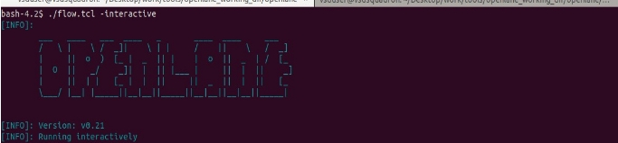
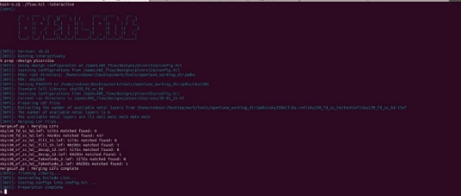
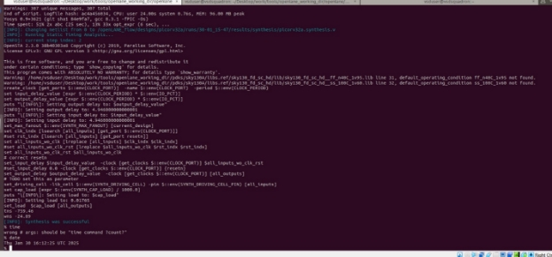
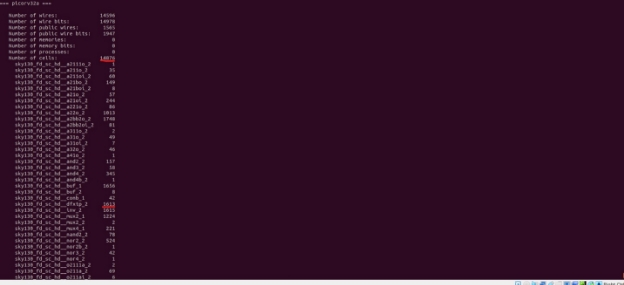
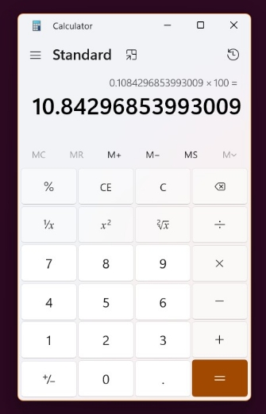
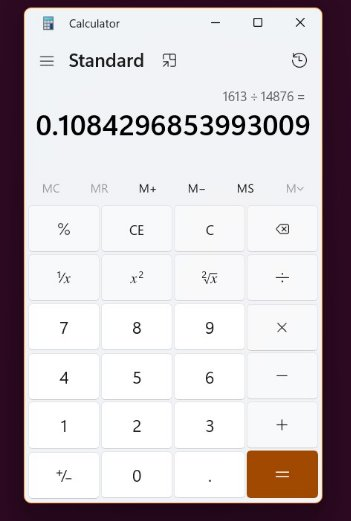

DAY-1 	Inception of open-source EDA, OpenLANE and Sky130 PDK.

*Workshop 1- Find Floppy disk ratio*

To get the Floppy disk ratio, we first need to run Synthesis.

Step-1: First, we run the command 

./flow.tcl -interactive in the docker.

Step-2: Now, we run the command 

prep -design picorv32a after the first step. 

Step-3: The final step is to do the command run\_synthesis.

Step-4: If we scroll a bit up now, we will find the heading ==picorv32a== . From this we can find the floppy disk ratio.

Floppy disk ratio = No. of Floppy disks ÷ Number of cells.

Step-5: The final thing to do is the division.

`             `= 1613 ÷ 14876

`		`= 0.108429

Percentage = 0.108429 x 100

			    = **10.8429.**

The ratio of Floppy Disks are **10.8429.**
