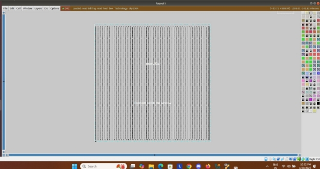

DAY-2 Good floorplan vs bad floorplan and introduction to library cells.

TASK-1: Obtain *magic* for floorplan

Q: What is magic?

ANS:  Magic is an interactive editor for VLSI layouts that runs under all variants of UNIX. 

Step-1: Type the command *magic -T /home/vsduser/Desktop/work/tools/openlane\_working\_dir/pdks/sky130A/lib s.tech/magic/sky130A.tech lef read ../../tmp/merged.lef def read picorv32a.floorplan.def &*   in the directory- */Desktop/work/tools/openlane\_working\_dir/openlane/designs/picorv32a/runs/30-01\_15-47/results/floorplan$ .*

The result we obtain is- 

When the *magic* is zoomed in, we get the see the cells.

TASK-2: Now we must obtain the product of *run\_placement*.

Step-1: Enter docker and type in the command *./flow.tcl -interactive.*

Step-2: Now, type the command                               *prep -design picorv32a.*

Step-3: Enter the command *run\_placement* to obtain the result.

