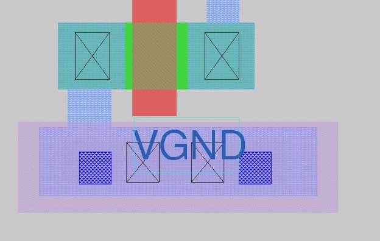
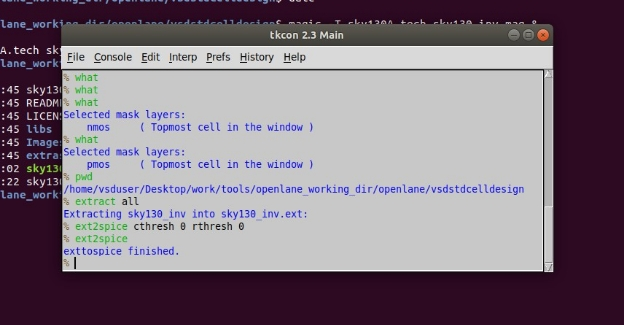
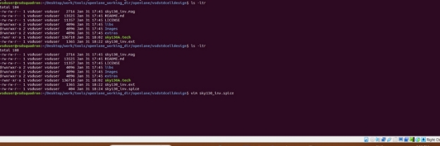

DAY-3 Design library cell using Magic Layout and ngspice characterization.

TASK-1: Obtain *magic* for the following.

Step-1: Run the command *magic -T sky130A.tech sky130\_inv.mag & ,* In the directory */Desktop/work/tools/openlane\_working\_dir/openlane/vsdstdcelldesign$ .*

Step-2: The result in then obtained.

A closer look of the *magic* is- 

																																																																																																																																		

Task-2: Obtain *ngspice.* 

Step-1: To obtain ngspice, we must extract the magic we have obtained from the previous task.

Step-2: Now, we must edit the file (sky130\_inv.spice) using the command vim.

Step-3: Edit the obtained output.

We have now successfully obtained *ngspice.* 

Task-3: Plot a graph in *ngspice.* 

Step-1: First, we run *ngspice* with the command ngspice sky130\_inv.spice. 

Step-2: We plot a graph using the command plot y vs time a. 

