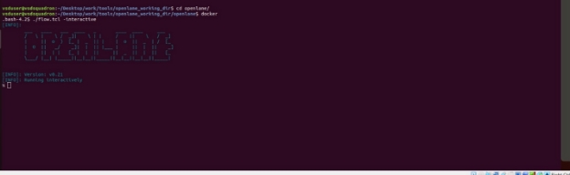

DAY-4 Pre-layout timing analysis and importance of good clock tree.

Task: Run the program *run\_cts.* 

Step-1: Run docker.

Step-2: Run the command *./flow.tcl -interactive* 

Step-3: Run the command *prep -design picorv32a.*

Step-4: The final this to do is run the command *run\_cts.*

